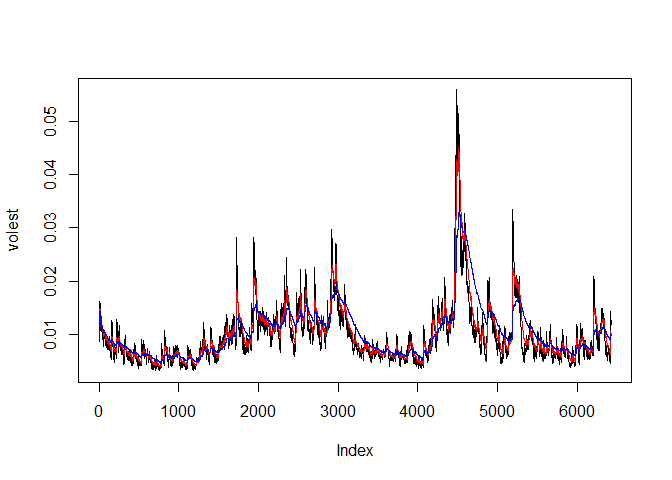

# S&P500
Sharon Teo  
July 11, 2016  

# Library required

```r
library(tseries)
```

# Download S&P500 data 

```r
SNPdata <- get.hist.quote('^gspc',quote="Close")
```

```
## time series ends   2016-07-08
```

# Length of S&P data

```r
length(SNPdata)
```

```
## [1] 6430
```

# Calculate S&P500 return using log

```r
SNPret <- log(lag(SNPdata))-log(SNPdata)
```

# Length of S&P log return

```r
length(SNPret)
```

```
## [1] 6429
```

# Calculate volatility of S&P in 250 trading days 

```r
SNPvol <- sd(SNPret) * sqrt(250) * 100
SNPvol
```

```
## [1] 18.00002
```

# Volatility function

```r
vol <- function(d,logrets){
  var=0
  lam=0
  varlist <- c()
  for (r in logrets) {
      lam = lam*(1 - 1/d) + 1
  var = (1 - 1/lam)*var + (1/lam)*r^2
        varlist <- c(varlist, var)
  }
  sqrt(varlist)
}
```
# Calculate volatility over entire length of series for various three different decay factors.

```r
volest <- vol(10, SNPret)
volest2 <- vol(30, SNPret)
volest3 <- vol(100, SNPret)
```

# Plot the results, overlaying the volatility curves on the data


```r
plot(volest, type="l")
lines(volest2, type="l",col="red")
lines(volest3, type="l",col="blue")
```

<!-- -->

